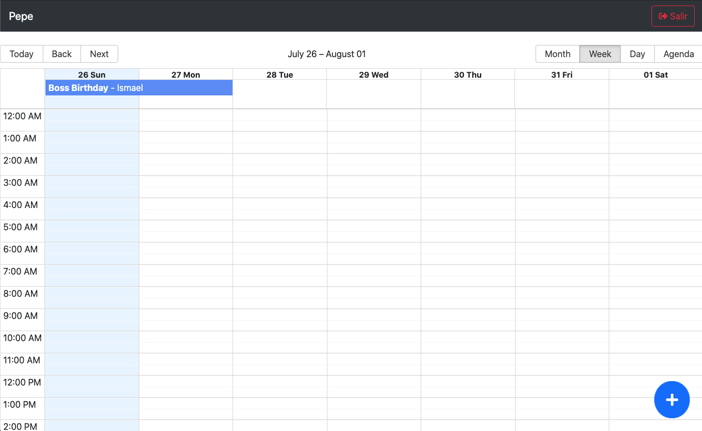
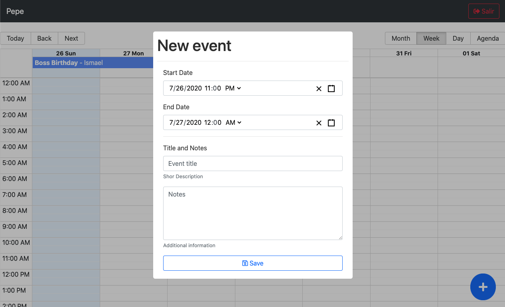
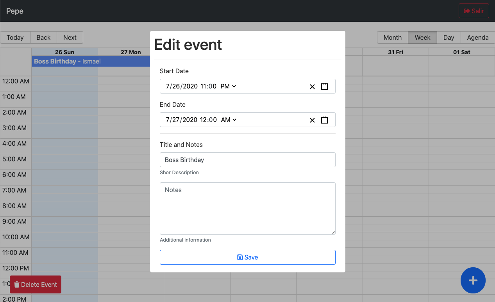

## Calendar App - Front end React Redux

This is a Calendar Event App, the front end part is built using React JS and Redux and friends.

Here you can create, read, update and delete (CRUD), events.

Some dependencies used:

[Create React App](https://github.com/facebook/create-react-app)

[Redux](https://redux.js.org/)

[React Redux](https://react-redux.js.org/)

[Redux Thunk](https://github.com/reduxjs/redux-thunk)

[React Router](https://reactrouter.com/)

[React Big Calendar](http://jquense.github.io/react-big-calendar/examples/index.html)

[React Datetime Picker](https://www.npmjs.com/package/react-datetime-picker)

[React Modal](https://www.npmjs.com/package/react-modal)

